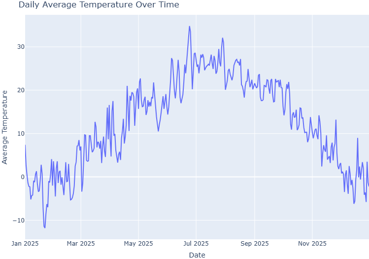
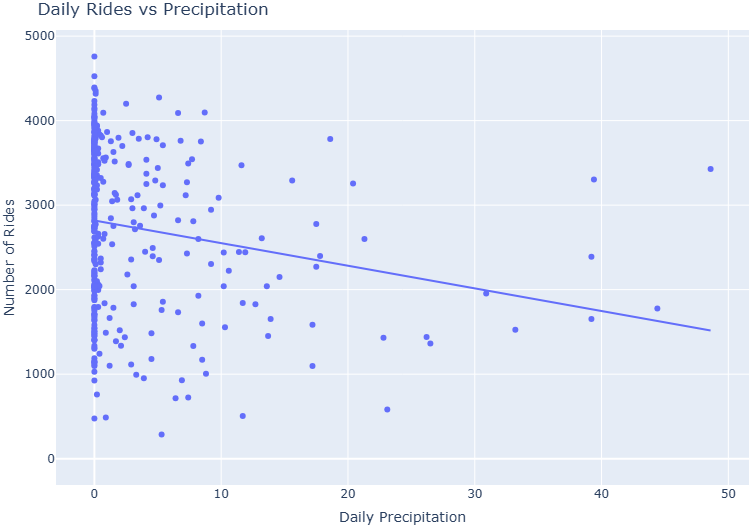
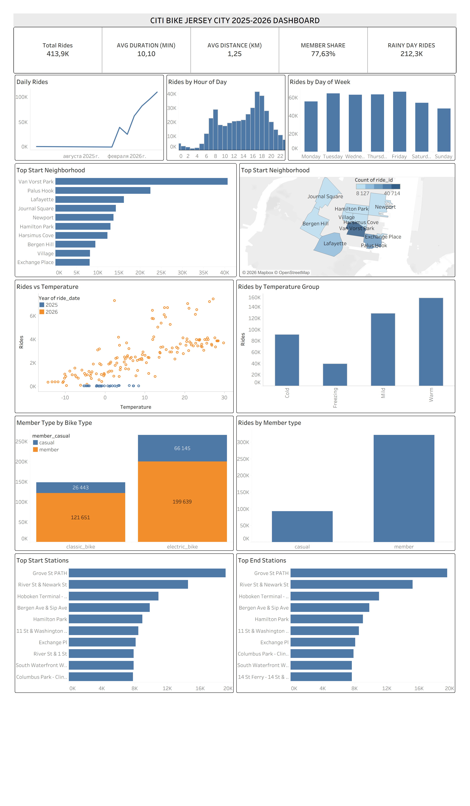

## Project Overview {.smaller}

This project analyzes **Jersey City Citi Bike trips (Feb 2025 – Jun 2026)** by combining trip, weather, and geographic data into a single PostgreSQL/PostGIS database, then visualized in Tableau.

## Objective {.smaller}

- Download data from multiple web sources
- Clean and prepare data with Python
- Perform exploratory and spatial analysis
- Store processed data in PostgreSQL/PostGIS
- Build a dashboard-ready Materialized View
- Connect Tableau to PostgreSQL
- Create a Tableau Extract
- Build an interactive analytics dashboard

## End-to-End Analytics Workflow {.smaller}

```{mermaid}
flowchart LR
    A[Citi Bike ZIP Files] --> D[Python]
    B[Weather API] --> D
    C[Neighborhood GeoJSON] --> D
    D --> E[(PostgreSQL / PostGIS)]
    E --> F[Materialized View]
    F --> G[Tableau]
    G --> H[Tableau Extract]
    H --> I[Interactive Dashboard]
```

---

## Technologies Used {.smaller}


:::: {.columns}

::: {.column width="50%"}

- <i class="fa-brands fa-python icon-lg"></i> **Python** — data collection, preparation, analysis
- <i class="fa-solid fa-table icon-lg"></i> **pandas** — tabular data manipulation
- <i class="fa-solid fa-earth-americas icon-lg"></i> **GeoPandas** — geospatial analysis
- <i class="fa-solid fa-cloud-arrow-down icon-lg"></i> **Requests** — downloading data and calling APIs
- <i class="fa-solid fa-database icon-lg"></i> **PostgreSQL** — analytical database

:::

::: {.column width="50%"}

- <i class="fa-solid fa-map-location-dot icon-lg"></i> **PostGIS** — spatial database extension
- <i class="fa-solid fa-link icon-lg"></i> **SQLAlchemy** — Python database integration
- <i class="fa-brands fa-docker icon-lg"></i> **Docker** — PostgreSQL/PostGIS environment
- <i class="fa-solid fa-chart-simple icon-lg"></i> **Tableau** — dashboard development
- <i class="fa-brands fa-github icon-lg"></i> **GitHub** — project version control

:::

::::

## 1. Downloading Data from the Web {.smaller}

The project starts with three independent external data sources.

### Citi Bike Trip Data

- Monthly Citi Bike ZIP files
- 17 monthly datasets (February 2025 – June 2026)
- Each ZIP file contains CSV trip records
- Jersey City trips only
   


## Downloading Citi Bike Data: Implementation {.smaller}

- Loops through each month and downloads the ZIP from Amazon S3
- Handles two file naming formats automatically
- Extracts the CSV from each ZIP into the data folder
- Deletes the ZIP file after extraction to save space


## Citi Bike Trip Data {.smaller}

The Citi Bike dataset contains individual bicycle trips.

### Important Variables
- `ride_id`
- `rideable_type`
- `started_at`
- `ended_at`
- `start_station_name`
- `end_station_name`
- `start_lat`
- `start_lng`
- `end_lat`
- `end_lng`
- `member_casual`

Each row represents **one Citi Bike trip**.

## Weather Data {.smaller}

- Open-Meteo Historical Weather API
- Daily weather observations
- JSON response converted to tabular format

---

## Weather Data: Implementation {.smaller}

- Calls Open-Meteo Historical Weather API for Jersey City coordinates
- Requests daily temperature, precipitation, snowfall, and wind speed
- Covers February 2025 – June 2026 to match trip data range
- Converts JSON response into a pandas DataFrame

---

## Daily Weather Variables {.smaller}

- Mean temperature
- Maximum temperature
- Minimum temperature
- Precipitation
- Rain
- Snowfall
- Maximum wind speed

---

## Neighborhood Geographic Data {.smaller}

The neighborhood dataset contains Jersey City polygon boundaries in **GeoJSON** format.

- Jersey City neighborhood GeoJSON
- Polygon boundaries used for spatial analysis
  
---

### Geographic Data Usage

- Identify the neighborhood of each start station
- Identify the neighborhood of each end station
- Aggregate rides geographically
- Compare neighborhood activity
- Create Tableau geographic visualizations

GeoPandas and PostGIS are used for spatial operations.

## 2. Preparing the Data {.smaller}

The raw datasets cannot be analyzed directly.

A data preparation pipeline is created in Python.

### Main Preparation Steps

1. Extract ZIP files
2. Load CSV files
3. Combine monthly trip datasets
4. Rename and standardize columns
5. Convert data types
6. Parse dates and timestamps
7. Remove duplicates
8. Validate coordinates
9. Handle missing values
10. Standardize formats

---

## Cleaning Citi Bike Data {.smaller}

Example Python workflow:

```python
import pandas as pd

citibike_df["started_at"] = pd.to_datetime(
    citibike_df["started_at"]
)

citibike_df["ended_at"] = pd.to_datetime(
    citibike_df["ended_at"]
)

citibike_df = citibike_df.drop_duplicates(
    subset="ride_id"
)
```

The main goal is to produce a consistent dataset before beginning the analysis.

---

## Feature Engineering {.smaller}

Several analytical variables are created from the original trip data.

:::: {.columns}

::: {.column width="33%"}

### Time Features

- Ride date
- Year
- Quarter
- Month
- Day of week
- Hour
- Weekend / weekday

:::

::: {.column width="33%"}

### Ride Features

- Ride duration
- Distance
- Distance category
- Duration category

:::

::: {.column width="33%"}

### Weather Features

- Rain flag
- Temperature category
- Weather conditions

:::

::::

---

## Example: Ride Duration {.smaller}

```python
citibike_df["duration_min"] = (
    citibike_df["ended_at"]
    - citibike_df["started_at"]
).dt.total_seconds() / 60
```

Ride duration allows us to analyze how long users typically keep a Citi Bike.


## 3. Analysis with Python {.smaller}

Python is used for the initial exploratory analysis before building the Tableau dashboard.

### Main Analysis Areas

- Exploratory Data Analysis
- Trip trends
- Member behavior
- Bike type usage
- Station activity
- Spatial patterns
- Weather impact
- Feature engineering

---

## Exploratory Data Analysis {.smaller}

The first stage focuses on understanding the structure and quality of the dataset.

### Questions

- How many trips were recorded?
- Are there missing values?
- Are there duplicate rides?
- What is the typical trip duration?
- Which stations are most frequently used?
- How does activity change during the year?

---

## Time Trend Analysis

Trip activity is analyzed across different time dimensions.

## Time Aggregations

- Daily rides
- Monthly rides
- Rides by hour
- Rides by weekday
- Seasonal activity

This helps identify commuting patterns and seasonal differences in bike usage.

## Daily Average Temperature

{fig-align="center" width="70%"}


## Member vs Casual Riders {.smaller}

Citi Bike users are divided into two main categories:

:::: {.columns}

::: {.column width="50%"}

### Member

- Subscription-based users
- More frequent usage
- Often associated with commuting behavior

:::

::: {.column width="50%"}

### Casual

- Non-subscription riders
- More recreational usage
- Potentially more sensitive to weather and seasonality

:::

::::

---

## Station Analysis {.smaller}

Station activity is analyzed using both departure and arrival information.

### Metrics

- Number of departures
- Number of arrivals
- Total station activity
- Most popular start stations
- Most popular end stations

This can help identify high-demand areas in the Citi Bike network.

---

## Spatial Analysis {.smaller}

Latitude and longitude coordinates allow us to perform geographic analysis.

### Spatial Operations

- Convert stations into geographic points
- Load neighborhood polygons
- Perform spatial joins
- Assign stations to neighborhoods
- Aggregate rides by neighborhood

Example:

```python
stations_with_neighborhood = gpd.sjoin(
    stations_gdf,
    neighborhoods_gdf,
    predicate="within"
)
```

---

## Weather Impact Analysis {.smaller}

Weather data is combined with daily Citi Bike activity.

### Questions

- Does temperature affect the number of rides?
- How does rainfall influence demand?
- Are rides lower on snowy days?
- Does wind speed influence activity?

The relationship between temperature and daily rides is particularly useful for understanding seasonal demand.

---

{fig-align="center" width="70%"}


## 4. Creating the Citi Bike Database {.smaller}

After the Python analysis, cleaned datasets are stored in **PostgreSQL**.

PostGIS is enabled to support geographic data.

### Database

- Database name: `citibike`
- Database engine: PostgreSQL
- Spatial extension: PostGIS
- Environment: Docker container

---

## Database Structure {.smaller}

Main database tables:

| Table | Description |
|---|---|
| `jersey_city` | Individual Citi Bike trips |
| `jersey_weather` | Daily weather observations |
| `jersey_city_neighborhoods` | Neighborhood polygons |
| `jc_stations` | Citi Bike station locations |

The database separates raw analytical entities while SQL is used to combine them for reporting.

---

## PostgreSQL + PostGIS {.smaller}

PostGIS extends PostgreSQL with geographic functionality.

Example spatial operation:

```sql
SELECT
    s.station_name,
    n.neighborhood
FROM jc_stations AS s
LEFT JOIN jersey_city_neighborhoods AS n
    ON ST_Within(
        s.geometry,
        n.geometry
    );
```

This assigns each station to its corresponding Jersey City neighborhood.


## 5. Dashboard-Ready Materialized View {.smaller}

Instead of asking Tableau to repeatedly join multiple large tables, a **Materialized View** is created.

```sql
CREATE MATERIALIZED VIEW
mv_tableau_citibike_dashboard
AS

SELECT
    ...
FROM jersey_city AS rides

LEFT JOIN jersey_weather AS weather
    ON rides.ride_date = weather.date;
```

The view becomes the main analytical dataset for Tableau.

---

## Why Use a Materialized View? {.smaller}

A Materialized View stores the result of the analytical query physically in PostgreSQL.

### Benefits

- Faster Tableau queries
- Centralized business logic
- Reusable analytical dataset
- Less processing inside Tableau
- Easier dashboard maintenance
- Consistent calculations

The final dataset follows a **wide-table structure** designed specifically for dashboard analysis.

---

## Dashboard Dataset {.smaller}

The Materialized View contains both original and derived variables.

:::: {.columns}

::: {.column width="50%"}

### Example Fields

- Ride ID
- Ride date
- Month
- Hour
- Day of week
- Member type
- Bike type
- Duration

:::

::: {.column width="50%"}


- Distance
- Start station
- End station
- Start neighborhood
- End neighborhood
- Temperature
- Rain
- Snow
- Weather flags

:::

::::

## 6. Connecting Tableau to PostgreSQL {.smaller}

Tableau Desktop connects directly to the PostgreSQL database.

### Connection Information

- Host: `localhost`
- Port: `5432`
- Database: `citibike`
- Schema: `public`
- Data source: `mv_tableau_citibike_dashboard`

This creates a centralized analytical data source instead of loading independent CSV files into Tableau.

---

## 7. Building a Tableau Extract {.smaller}

After connecting to PostgreSQL, a Tableau **Extract** is created.

### Source

`mv_tableau_citibike_dashboard`

### Extract Format

`.hyper`

### Why Use an Extract?

- Faster dashboard performance
- Optimized Tableau aggregations
- Reduced database workload
- Dashboard can work offline
- Smaller analytical file

---

## 8. Tableau Dashboard {.smaller}

The final stage is an interactive Tableau dashboard.

### Dashboard Components

:::: {.columns}

::: {.column width="50%"}

- KPI cards (Total Rides, Avg Duration, Avg Distance, Member Share, Rainy Day Rides)
- Daily Rides trend
- Rides by Hour of Day
- Rides by Day of Week
- Top Start Neighborhood (bar chart + map)

:::

::: {.column width="50%"}

- Rides vs Temperature
- Rides by Temperature Group
- Member Type by Bike Type
- Rides by Member Type
- Top Start Stations
- Top End Stations

:::

::::

---


## Full Dashboard Overview {.smaller}

::: {style="text-align: center;"}
[{height=580px}](img/dashboard_1){target="_blank"}
:::

---


## Dashboard KPIs {.smaller}

The dashboard begins with a high-level overview of Citi Bike activity.

### Example KPIs

- Total rides
- Average ride duration
- Average ride distance
- Member share
- Number of rainy-day rides

KPIs allow users to understand the overall performance before exploring individual charts.

---

## Dashboard: Time Analysis {.smaller}

The dashboard provides several views of activity over time.

### Visualizations

- Daily ride trend
- Rides by hour of day
- Rides by day of week
- Monthly trend

These charts help identify peak usage periods and seasonal patterns.

---

## Dashboard: Geographic Analysis {.smaller}

Neighborhood and station information is displayed geographically.

### Geographic Visualizations

- Top start neighborhoods
- Top end neighborhoods
- Start station activity
- End station activity

Spatial analysis helps reveal which parts of Jersey City generate the highest Citi Bike demand.

---

## Dashboard: Weather Analysis {.smaller}

Weather measures are connected with Citi Bike demand.

### Analysis

- Rides vs temperature
- Daily rides and temperature trend
- Rainy-day usage
- Seasonal weather changes

This can help explain why demand changes throughout the year.

---

## Final Data Architecture {.smaller}

```text
Citi Bike ZIP Files
        |
Weather API ---------> Python
        |               |
Neighborhood GeoJSON    |
                        v
              Data Preparation
                        |
                        v
              Python Analysis
                        |
                        v
              PostgreSQL/PostGIS
                        |
                        v
               Materialized View
                        |
                        v
                    Tableau
                        |
                        v
                Tableau Extract
                        |
                        v
               Interactive Dashboard
```

---

## What I Learned {.smaller}

This project demonstrates that a dashboard is only the final stage of a much larger analytics workflow.

### Main Lessons

- Working with multiple data sources
- Automating web data collection
- Cleaning large datasets with pandas
- Performing spatial analysis
- Using PostgreSQL and PostGIS
- Creating analytical SQL views
- Connecting databases to Tableau
- Designing dashboard-ready datasets
- Building interactive visual analytics

---

## Key Takeaway {.smaller}

The main objective was not only to create visualizations.

The project demonstrates a complete **end-to-end Data Analytics workflow**:

**Web Data → Python → Analysis → PostgreSQL/PostGIS → Tableau → Dashboard**

This approach separates:

**Data Collection → Data Preparation → Analytics → Storage → Visualization**

and creates a workflow that is easier to reproduce, maintain, and extend.

---

## Thank You {.smaller}

### Citi Bike Jersey City 2025–2026

**End-to-End Data Analytics Project**

Python · pandas · GeoPandas · PostgreSQL · PostGIS · Tableau
Show less


